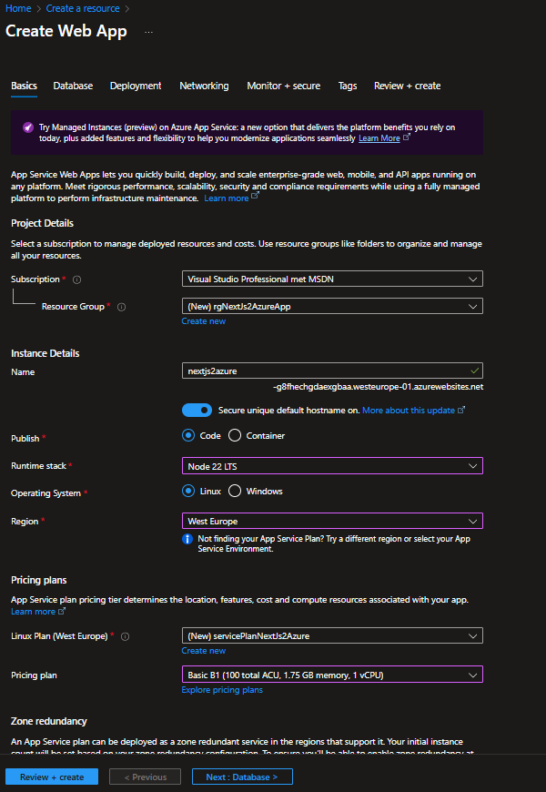
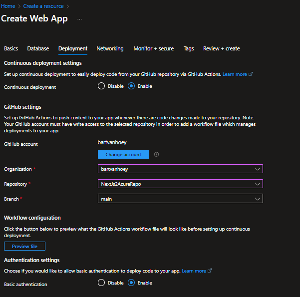

# Deploy NextJs to Azure: Step-by-Step Guide

This guide will walk you through the process of deploying a Next.js application to Microsoft Azure. Follow these steps to get your application up and running in the cloud.

## Step 1: Create a GitHub Repository

First, create a new repository on GitHub to host your Next.js application code.

## Step 2: Create a Next.js Application

If you haven't already created a Next.js application, you can do so by running the following command:

```bash
// create a new Next.js app
npx create-next-app@latest your-name-app --yes
// navigate into the app directory
cd my-nextjs-app
// start the development server
npm run dev
```

## Step 3: Update next.config.js

In your Next.js project, open the `next.config.js` file and update the following configuration:

```javascript
module.exports = {
    reactStrictMode: true,
    distDir: "build",
    output: "standalone",
};
```

## Step 4: Add an .env.local file to root of Next.Js project

Create a file `.env.local` in the root of your Next.Js project and add the following environment variable:

```bash
NEXT_PUBLIC_BASE_URL=http://localhost:3000
```

## Step 5: Push Your Code to GitHub

Initialize a git repository, commit your code, and push it to your GitHub repository:

```bash
git add .
git commit -m "Initial commit"
git push
```

## Step 6: Create an Web App on Azure

Login into the Azure Portal. Click on Create a resource and search for Web App. 
Set up a new Web App on Azure by following these steps:





Review and create the web app.

## Step 7: Copy the Publish Profile and the Default domain url

Once the Web App is created, navigate to the Web App's Overview page. Click on "Get publish profile" to download the publish profile XML file. Copy the XML content from this file.

Copy the Default domain url from the Overview page as well, you will need it later.

## Step 8: Add Action Secrets in GitHub

In your GitHub repository, navigate to the Settings > Secrets and variables > Actions section. Add the following secrets:

- `AZURE_WEBAPP_PUBLISH_PROFILE`: Paste the content of the publish profile XML file you copied earlier.
- `NEXT_PUBLIC_BASE_URL`: Paste the Default domain url you copied earlier.


